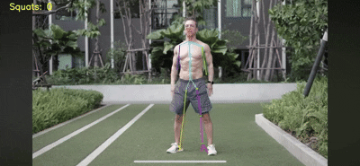

# Physical Exercise Detection — Squat Counter

Краткое описание
- Этот проект реализует пайплайн детекции ключевых точек человека и подсчёта приседаний на видео. Используются модели на базе YOLO (Ultralytics) с keypoint-выходом; данные подготавливались через Roboflow.

**Структура репозитория**
- **inference.ipynb**: ноутбук для инференса и подсчёта приседаний. Содержит функцию `count_squats()` для обработки видео.
- **train.ipynb**: ноутбук для подготовки данных и обучения модели (скачивание из Roboflow, визуализация, запуск обучения Ultralytics YOLOv8).
- **vidoes/**: примеры и входные видео для тестов.

**Краткое описание подхода**
- Разработал end-to-end пайплайн обнаружения ключевых точек и подсчёта упражнений (приседаний) на видео.
- Обучение и разметка: Roboflow → YOLOv8 keypoint model (Ultralytics).
- Инженерные решения: стабилизация инференса на видео, пороговая логика детекции движений, визуализация скелета и аннотаций в OpenCV.
- Модель определяет keypoints (таз, колено, голеностоп и т.д.). Подсчёт приседаний реализован через вычисление угла в колене (точки: groin - knee - ankle). Переход вниз/вверх по порогам угла считается одним приседом.
- Визуализация: отрисовка точек и скелета на фреймах, вывод счётчика поверх видео.
- Технологии: Python, PyTorch, Ultralytics YOLOv8, Roboflow, OpenCV, NumPy, Matplotlib.

**Требования**
- Python 3.8+
- Основные пакеты: `ultralytics`, `roboflow`, `opencv-python`, `torch` (совместимая версия), `numpy`, `matplotlib`, `Pillow`

**Где посмотреть**
- Ноутбук инференса: [inference.ipynb](inference.ipynb)
- Ноутбук обучения: [train.ipynb](train.ipynb)
- Весы моделей: [models/](models/)
